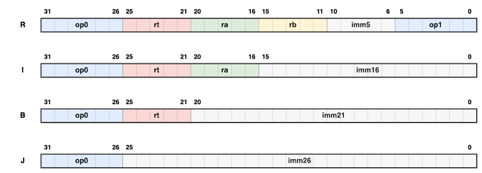

# CUP: Completely Useless Processor

## Introduction

The Completely Useless Processor (CUP) is a hypothetical CPU at the heart of
the [Completely Useless System](cus.md) (CUS). CUP is a simple 32-bit CPU
inspired by the
[RISC](https://en.wikipedia.org/wiki/Reduced_instruction_set_computer)
design-principles. It aims to provide a simple and regular
[ISA](https://en.wikipedia.org/wiki/Instruction_set_architecture) with a set of
reduced instructions (and *not* a reduced set of instructions) for the most
common tasks.

A 32-bit CPU happens to be more than enough for my educational-needs, so CUP is
not a 64-bit CPU like modern CPUs. This makes it much easier to efficiently
simulate it on older hardware. CUP is designed to represent a modest circa 2000s
"desktop-class" CPU. It does *not* aim to serve memory-constrained embedded
devices or "big-iron" server-class hardware. CUP therefore uses non-compact
32-bit instructions and can only address up to 4 GiB of physical RAM.

The native word-size for CUP is 32 bits. It allows programs to read and write
from unaligned memory-locations, albeit with a slight performance-penalty. It
also allows directly reading and writing half-words (16 bits) and bytes (8 bits)
for convenience.

Note that an instruction in CUP might take more than one cycle to execute even
when all the data is readily available in registers (e.g. the multiplication and
division instructions). Note also that CUP does not use delay slots and an
instruction might stall waiting for data to be written from a previous
instruction. These characterisitcs are different from some stricter RISC CPUs.

Input/output is memory-mapped. The memory-controller in CUS maps I/O devices to
certain physical memory-addresses such that reads/writes from/to these addresses
automatically result in communication with the corresponding I/O peripheral.

## Registers

CUP provides access to 32 general-purpose 32-bit integer registers. These are
numbered from `r0` to `r31`. Of these 32 registers, `r0` is hard-wired to zero
(writes to it are ignored and reads from it always return `0`) and `r31` is
the link-register used to pass the return-address during procedure-calls. The
calling-conventions for a programming-language would typically impose further
restrictions on how the remaining 30 registers should be used.

For temporarily holding a 64-bit extended-precision value during multiplication
or division, there is an additional `ep` register to hold the upper 32 bits of a
product or dividend respectively.

CUP has a 32-bit program-counter register `pc` that points to the next
instruction to be executed by the CPU. There are no instructions to directly
access `pc`.

CUP also has a 32-bit `psr` register to represent various bits of information
about the program-state. As of now, only four flags are defined -- `N`
(negative), `O` (overflow), `C` (carry), and `Z` (zero) -- to represent various
conditions for integer arithmetic.

Note that the integer condition-code flags are usually only set by some
arithmetic (and some logical) instructions that explicitly request them to be
set. They are otherwise not set, in order to reduce implicit inter-instruction
data-dependencies.

## Instructions

Instructions for CUP are fixed-length 32-bit words. They must be word-aligned
in memory (thus the least significant two bits of the `pc` register must always
be zero).

### Encoding

The following diagram shows the instruction-formats used by CUP:

As can be seen from the diagram, each instruction-format encodes fields with
similar meanings at the same positions. For example:

*   The 6 bits in positions 31-26 form the `op0` field common to *all*
formats and contain the primary opcode for the instruction.
*   The 5 bits in positions 25-21 form the `rt` field for formats that use it
to represent the target register of an operation.
*   The 5 bits in positions 20-16 form the `ra` field for formats that use it
to represent the primary source operand register of an operation.

The instruction-formats are:

1.  R-type, for instructions with a target register operand `rt` and two source
register operands `ra` and `rb` (or that need a small immediate operand `imm5`,
like some logical shift instructions).
1.  I-type, for instructions with a target register operand `rt`, a source
register operand `ra`, and a sign-extended 16-bit immediate operand `imm16`
(zero-extended in case of logical instructions).
1.  B-type, for instructions that use a single register operand `rt` and a
21-bit sign-extended immediate operand `imm21` (like conditional branch
instructions).
1.  J-type, for instructions that need to use all the available space for a
sign-extended 26-bit immediate operand `imm26` (like unconditional jumps).

The uniform encoding of instructions make it relatively easy to decode them for
execution.

### Conventions

The mnemonics for the instructions in this document are always 4 uppercase
letters (32-bit mnemonics for 32-bit instructions). The target of an instruction
comes before its source operands.

The descriptions of the instructions in the following subsections use a C-like
pseudo-code for brevity and unambiguity with the following additional semantics:

*   `R[n]` is the value of the integer-register numbered `n`.
*   `M[n]` is the word at the memory-location `n`.
*   `x:y` is the bit-field comprising bits numbered `x` (MSB) and `y` inclusive.
*   `SgnExt()` refers to sign-extension, while `ZerExt()` is zero-extension.
*   `IsSet()` is true when the given flag is set, false otherwise.
*   "Mnem" is short for "instruction-mnemonic".
*   "Fmt" is short for "instruction-format", denoting one of the R-, I-, B-, or
J-type of encoding.
*   "OpC" is short for "operation-code" (aka opcode). All numbers are hexadecimal. Just `nn` means only the `op0` field is set to this value, while `nn/mm` means
that `op0` is set to `nn`, while `op1` is set to `mm`.
*   "Like ABCD, but sets flags" is short for "The same behavior as the ABCD
instruction, but also sets the relevant condition-code flags in the `psr`
register".

### Logical Instructions

CUP provides instructions for performing logical operations like AND, OR, etc.
and for shifting bits in a register. The following table summarizes these
logical instructions:

| Mnem | Instruction | Operation | Fmt | OpC |
| :---- | :---------- | :-------- | :-: | :-- |
| SLLR | Shift left logical by register-value. | `R[rt] = R[ra] << R[rb]` | R | 00/00 |
| SLRF | Like SLLR, but sets flags. | `R[rt] = R[ra] << R[rb]` | R | 00/01 |
| SRLR | Shift right logical by register-value. | `R[rt] = R[ra] >> R[rb]` (unsigned) | R | 00/02 |
| SRRF | Like SRLR, but sets flags. | `R[rt] = R[ra] >> R[rb]` (unsigned) | R | 00/03 |
| SRAR | Shift right arithmetic by register-value. | `R[rt] = R[ra] >> R[rb]` (signed) | R | 00/04 |
| SRAS | Like SRAR, but sets flags. | `R[rt] = R[ra] >> R[rb]` (signed) | R | 00/05 |
| SLLI | Shift left logical by immediate-value. | `R[rt] = R[ra] << imm5` | R | 00/06 |
| SLIF | Like SLLI, but sets flags. | `R[rt] = R[ra] << imm5` | R | 00/07 |
| SRLI | Shift right logical by immediate-value. | `R[rt] = R[ra] >> imm5` (unsigned) | R | 00/08 |
| SRIF | Like SRLI, but sets flags. | `R[rt] = R[ra] >> imm5` (unsigned) | R | 00/09 |
| SRAI | Shift right arithmetic by immediate-value. | `R[rt] = R[ra] >> imm5` (signed) | R | 00/0a |
| SRAJ | Like SRAI, but sets flags. | `R[rt] = R[ra] >> imm5` (signed) | R | 00/0b |
| ANDR | Bit-wise AND of registers. | `R[rt] = R[ra] & R[rb]` | R | 00/0c |
| ADRF | Like ANDR, but sets flags. | `R[rt] = R[ra] & R[rb]` | R | 00/0d |
| ORRR | Bit-wise OR of registers. | `R[rt] = R[ra] \| R[rb]` | R | 00/0e |
| ORRF | Like ORRR, but sets flags. | `R[rt] = R[ra] \| R[rb]` | R | 00/0f |
| NOTR | Bit-wise NOT of a register. | `R[rt] = ~R[ra]` | R | 00/10 |
| NOTF | Like NOTR, but sets flags. | `R[rt] = ~R[ra]` | R | 00/11 |
| XORR | Bit-wise XOR of registers. | `R[rt] = R[ra] ^ R[rb]` | R | 00/12 |
| XORF | Like XORR, but sets flags. | `R[rt] = R[ra] ^ R[rb]` | R | 00/13 |
| ANDI | Bit-wise AND with imm-value; sets flags. | `R[rt] = R[ra] & ZerExt(imm16)` | I | 01 |
| ORRI | Bit-wise OR with imm-value; sets flags. | `R[rt] = R[ra] \| ZerExt(imm16)` | I | 02 |
| XORI | Bit-wise XOR with imm-value; sets flags. | `R[rt] = R[ra] ^ ZerExt(imm16)` | I | 03 |

Note from the above that a word with all zeroes is the same as the instruction
"SLLR r0, r0, r0", which has no effect (recall that `r0` is all zeroes and is
also read-only). The usual "NOP" (no-operation) instruction is thus just a
pseudo-instruction that maps to "SLLR r0, r0, r0".

### Arithmetic Instructions

CUP supports the usual set of integer arithmetic operations. Since the
multiplication of two 32-bit numbers can yield upto 64 bits, the register `ep`
holds the upper 32 bits of a multiplication-result. It can also be used to hold
the upper 32 bits of a 64-bit dividend before division and the remainder after
division. `ep` can be populated using the WREP instruction and can be read via
the RDEP instruction.

The following table summarizes the arithmetic instructions:

| Mnem | Instruction | Operation | Fmt | OpC |
| :---- | :---------- | :-------- | :-: | :-- |
| ADDR | Add two registers. | `R[rt] = R[ra] + R[rb]` | R | 00/14 |
| ADDF | Like ADDR, but sets flags. | `R[rt] = R[ra] + R[rb]` | R | 00/15 |
| SUBR | Subtract two registers. | `R[rt] = R[ra] - R[rb]` | R | 00/16 |
| SUBF | Like SUBR, but sets flags. | `R[rt] = R[ra] - R[rb]` | R | 00/17 |
| MULR | Multiply two registers. | `ep:R[rt] = R[ra] * R[rb]` | R | 00/18 |
| MULF | Like MULR, but sets flags. | `ep:R[rt] = R[ra] * R[rb]` | R | 00/19 |
| DIVR | Divide two registers. | `R[rt] = ep:R[ra] / R[rb]; ep = ep:R[ra] % R[rb]` | R | 00/1a |
| DIVF | Like DIVR, but sets flags. | `R[rt] = ep:R[ra] / R[rb]; ep = ep:R[ra] % R[rb]` | R | 00/1b |
| RDEP | Read the value in `ep`. | `R[rt] = ep` | R | 00/1c |
| WREP | Write a value to `ep`. | `ep = R[ra]` | R | 00/1d |

### Control-Flow Instructions

CUP provides a few control-flow instructions for conditional and unconditional
jumps in a program. For procedure-calls, the `r31` register additionally holds
the return-address. Note that address-calculations are usually relative to the
`pc` register, use sign-extended immediate values, and have wraparound
semantics over the entire 4GB address-space.

The following table summarizes the control-flow instructions:

| Mnem | Instruction | Operation | Fmt | OpC |
| :---- | :---------- | :-------- | :-: | :-- |
| JMPR | Jump to an address based on register-values. | `pc = R[ra] + (R[rb] << imm5)` | R | 00/1e |
| JALR | Like JMPR, but also sets up the link-register. | `R[31] = pc + 4; pc = R[ra] + (R[rb] << imm5)` | R | 00/1f |
| JMPI | Jump to the word-address in `imm26`. | `pc += SgnExt(imm26) << 2` | J | 05 |
| JALI | Like JMPI, but also sets up the link-register. | `R[31] = pc + 4; pc += SgnExt(imm26) << 2` | J | 06 |
| BRNR | Branch if `N` is set. | `pc = IsSet(N) ? R[rt] + SgnExt(imm21) : pc + 4` | B | 07 |
| BROR | Branch if `O` is set. | `pc = IsSet(O) ? R[rt] + SgnExt(imm21) : pc + 4` | B | 08 |
| BRCR | Branch if `C` is set. | `pc = IsSet(C) ? R[rt] + SgnExt(imm21) : pc + 4` | B | 09 |
| BRZR | Branch if `Z` is set. | `pc = IsSet(Z) ? R[rt] + SgnExt(imm21) : pc + 4` | B | 0a |
| BRNE | Branch if registers are not equal. | `pc += R[rt] != R[ra] ? SgnExt(imm16) : 4` | B | 0b |
| BRGT | Branch if one register is greater than another. | `pc += R[rt] > R[ra] ? SgnExt(imm16) : 4` | B | 0c |

### Load-Store Instructions

Load-store instructions are the only way to transfer data from or to memory.
Note that you can load a 32-bit constant into a register by using a combination
of ORRI with `r0` and LDUI. For example, "ORRI r3, r0, 0x5678" followed by
"LDUI r3, 0x1234" loads the 32-bit constant 0x12345678 into `r3`. The OR with
`r0` trick can also be used to copy values across registers. For example, the
instruction "ORRR r4, r3, r0" copies over the value in `r3` into `r4`.

The following table summarizes the load-store instructions:

| Mnem | Instruction | Operation | Fmt | OpC |
| :---- | :---------- | :-------- | :-: | :-- |
| LDUI | Load the upper 16 bits of a register. | `R[rt](31:16) = imm16` | I | 0d |
| LDWD | Load a word into a register. | `R[rt] = M[R[ra] + SgnExt(imm16)]` | I | 0e |
| LDHS | Load a sign-extended half-word into a register. | `R[rt] = SgnExt(M[R[ra] + SgnExt(imm16)](15:0))` | I | 0f |
| LDHU | Load a zero-extended half-word into a register. | `R[rt] = ZerExt(M[R[ra] + SgnExt(imm16)](15:0))` | I | 10 |
| LDBS | Load a sign-extended byte into a register. | `R[rt] = SgnExt(M[R[ra] + SgnExt(imm16)](7:0))` | I | 11 |
| LDBU | Load a zero-extended byte into a register. | `R[rt] = ZerExt(M[R[ra] + SgnExt(imm16)](7:0))` | I | 12 |
| STWD | Store a word into memory. | `M[R[ra] + SgnExt(imm16)] = R[rt]` | I | 13 |
| STHW | Store a half-word into memory. | `M[R[ra] + SgnExt(imm16)](15:0) = R[rt](15:0)` | I | 14 |
| STSB | Store a byte into memory. | `M[R[ra] + SgnExt(imm16)](7:0) = R[rt](7:0)` | I | 15 |

## TODOs

To be a bit more realistic, CUP still needs support for a great many things:

*   How to interact with hardware peripherals for input/output.
*   Raising and handling traps.
*   Calling-convention for C programs.
*   User versus supervisor mode and privileged instructions.
*   Memory-management unit and support for virtual memory.
*   Floating-point arithmetic.
*   Simulation of a memory-hierarchy, including appropriate latency-hits.
*   Multi-core support, including having a well-defined memory-model.
*   Pipelined execution of instructions.
*   (Nice to have) Vector instructions for multimedia.
*   Et cetera.

I plan to add support for these in due course of time.
